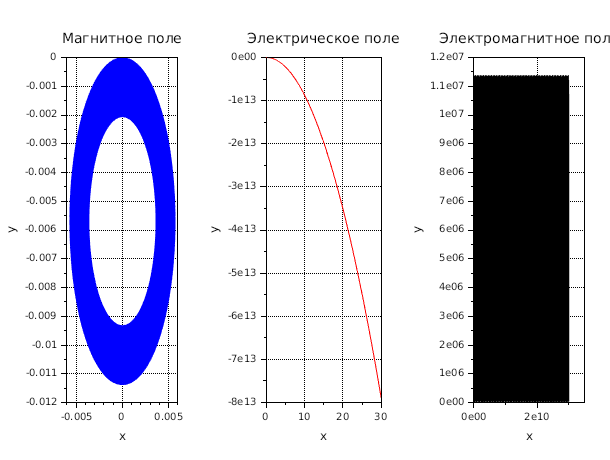

# Движение заряженных частиц в скрещенных полях

## Описание

Моделирование движения заряженной частицы в магнитном, электрическом и комбинированном электромагнитном полях.

## Файлы

### lab1.sce

Численное моделирование траекторий заряженной частицы в различных конфигурациях полей:

1. **Магнитное поле** - частица движется по окружности (циклотронное движение)
2. **Электрическое поле** - частица ускоряется вдоль направления поля
3. **Скрещенные электрическое и магнитное поля** - комбинированное движение (дрейф)

## Запуск

```bash
scilab-adv-cli -f lab1.sce
```

## Примеры результатов

### Движение заряженной частицы


Слева: циклотронное вращение в магнитном поле.
В центре: прямолинейное ускорение в электрическом поле.
Справа: сложная траектория в скрещенных полях - комбинация дрейфа и вращения.
