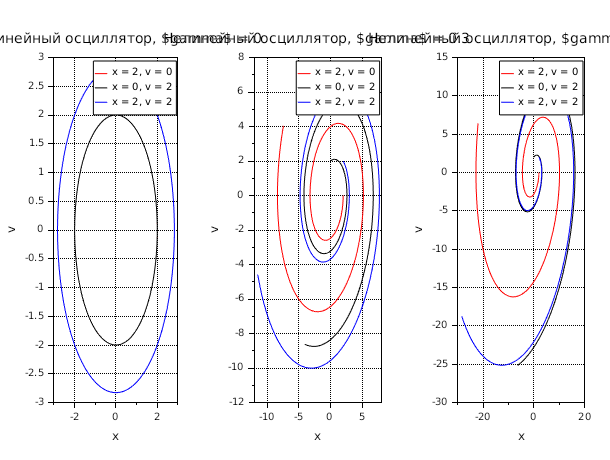
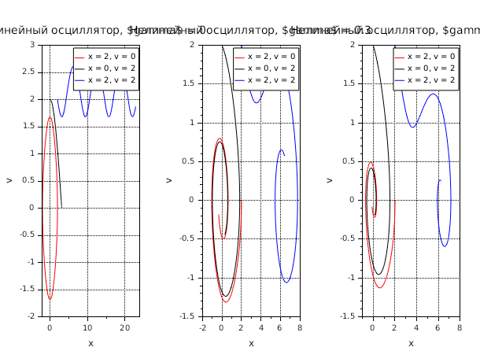
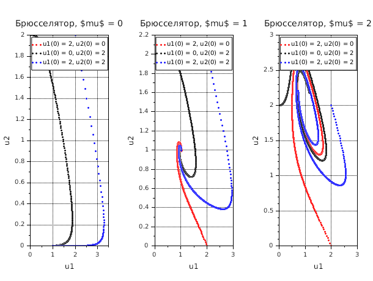
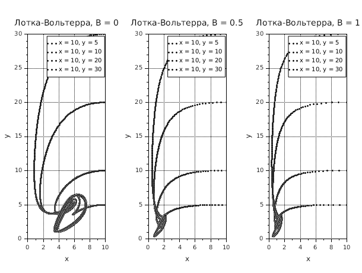

# Фазовые портреты динамических систем

## Описание

Моделирование и визуализация фазовых портретов различных динамических систем.

## Файлы

### lab3.sce

Численное моделирование четырех классических динамических систем:

1. **Линейный осциллятор** - гармонические колебания с затуханием
2. **Нелинейный осциллятор** - гармонические колебания с затуханием и нелинейностью
3. **Брюсселятор** - модель автокаталитической химической реакции
4. **Лотка-Вольтерра** - модель "хищник-жертва"

## Запуск

```bash
scilab-adv-cli -f lab3.sce
```

## Примеры результатов

### Линейный осциллятор


Фазовые портреты при различных коэффициентах затухания. Видно как система переходит от недозатухающих колебаний к перезатуханию.

### Нелинейный осциллятор (Дюффинга)


Демонстрирует нелинейные эффекты: искажение траекторий, множественные устойчивые состояния.

### Брюсселятор


Автоколебательная химическая система. При
 определенных параметрах наблюдаются предельные циклы.

### Модель Лотка-Вольтерра (хищник-жертва)


Замкнутые траектории демонстрируют циклические колебания популяций хищников и жертв.
