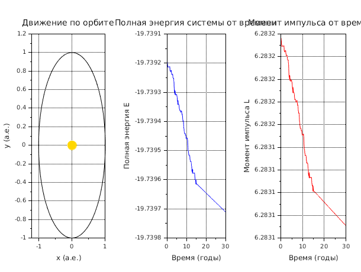
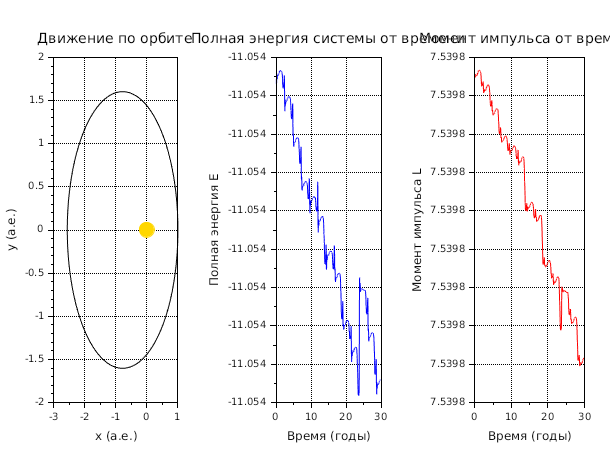
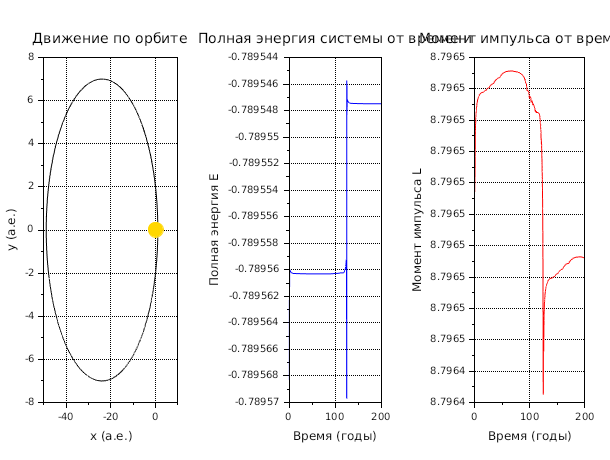
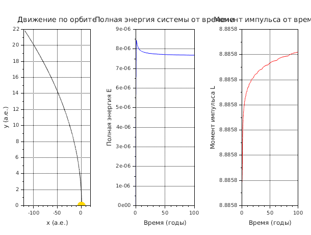
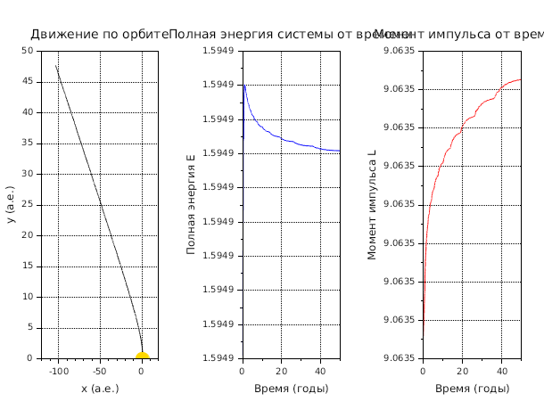
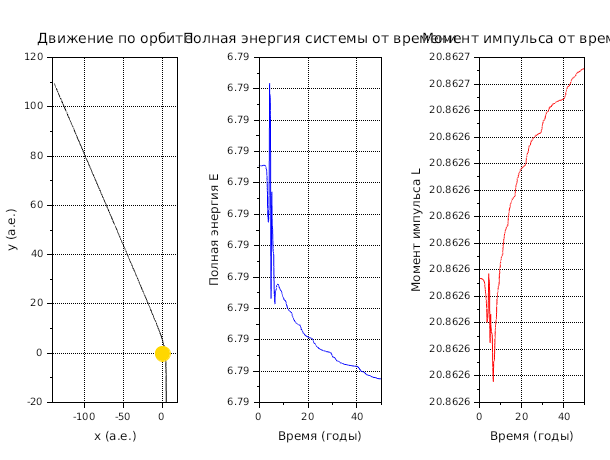
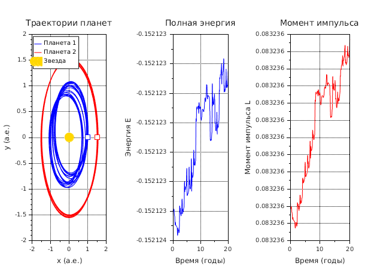
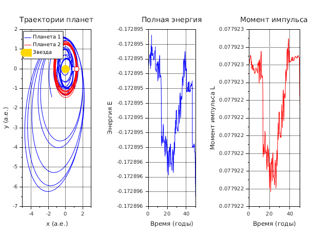
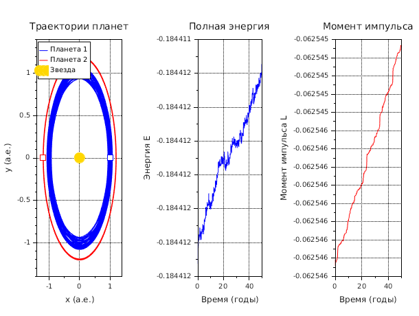
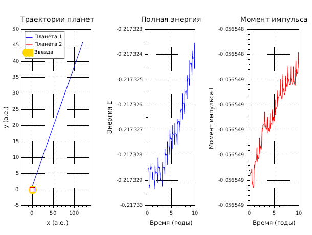

# Задача Кеплера

## Описание

Численное моделирование движения планет под действием гравитации центральной звезды.

## Файлы

### lab41.sce
Моделирование движения одной планеты вокруг звезды с различными типами орбит:
- Круговая орбита (e ≈ 0)
- Эллиптическая орбита (e < 1)
- Параболическая орбита (e = 1)
- Гиперболическая орбита (e > 1)

### lab42.sce
Задача трех тел: моделирование взаимодействия двух планет и центральной звезды.

## Запуск

```bash
scilab-adv-cli -f lab41.sce -quit
scilab-adv-cli -f lab42.sce -quit
```

## Примеры результатов

### Круговая орбита


Идеальная окружность. Энергия и момент импульса постоянны.

### Эллиптическая орбита (слабая)


Слегка вытянутая орбита с эксцентриситетом e ≈ 0.3.

### Эллиптическая орбита (умеренная)


Заметно вытянутая орбита с эксцентриситетом e ≈ 0.5.

### Параболическая орбита


Граничная траектория (e = 1). Планета уходит на бесконечность с нулевой скоростью. Энергия E = 0.

### Гиперболическая орбита (близкий пролёт)


Незамкнутая траектория (e > 1). Планета пролетает мимо звезды и уходит с остаточной скоростью.

### Гиперболическая орбита (дальний подлёт)


Гипербола при старте с большого расстояния, демонстрирует плавное искривление траектории.

### Задача трех тел - стабильная конфигурация


Планеты достаточно далеко друг от друга. Взаимное влияние слабое, орбиты почти круговые.

### Задача трех тел - умеренное взаимодействие


Планеты ближе, орбиты искажаются под влиянием взаимного притяжения.

### Задача трех тел - гравитационное рассеяние


Сильное взаимодействие. Одна планета получает энергию и выбрасывается из системы, другая остаётся.

### Задача трех тел - противоположные орбиты


Планеты стартуют по разные стороны от звезды. Гравитационный манёвр при сближении.

### Задача трех тел - встречная конфигурация


Планеты движутся навстречу друг другу, демонстрируя сложную динамику взаимодействия.
